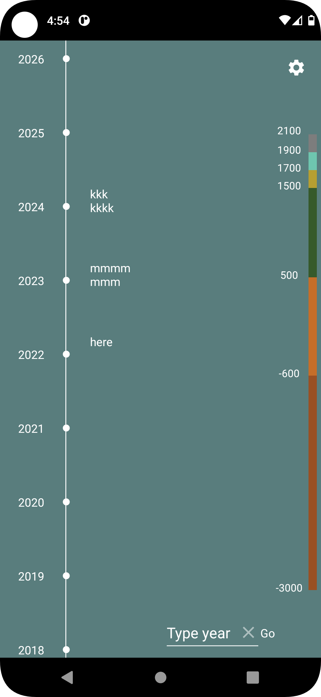
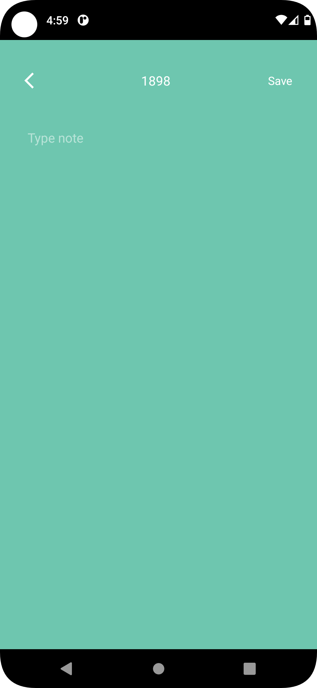
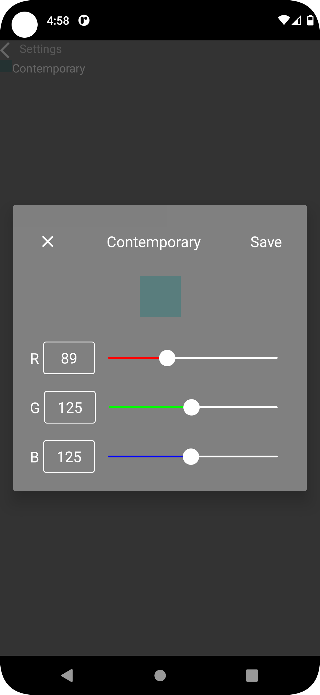

# timeline

a draft for final timeline app\
written during school project\
currently in Java, file as data, old tech, no architecture\
plan to write properly with new tech in Kotlin\
and then improve 

  
 
